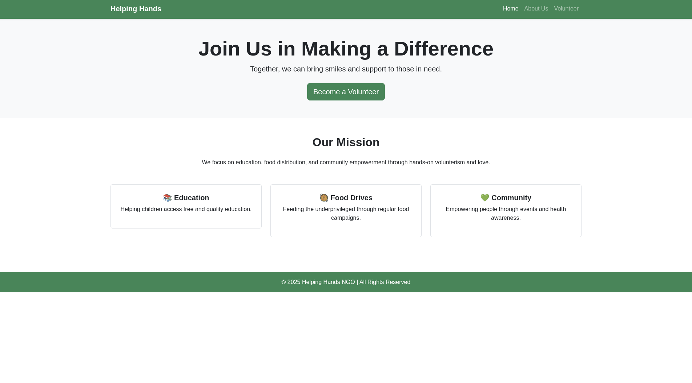
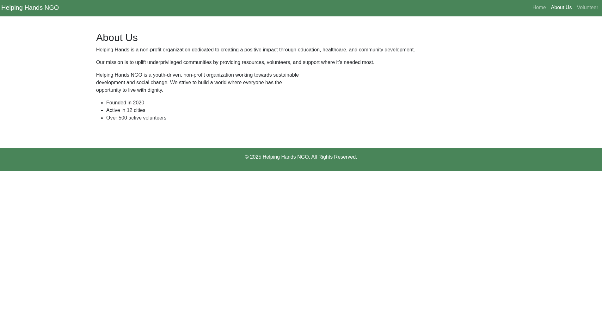
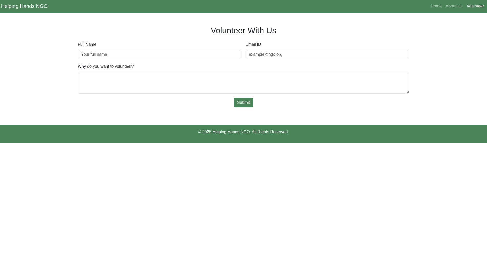

 # 🌱 Helping Hands NGO Website

A modern, responsive website built for a non-governmental organization (NGO) called **Helping Hands**. This static website is designed using **HTML**, **CSS**, and **Bootstrap 5**, featuring a clean design and mobile-friendly layout.

---

## 📄 Project Pages

| Page          | Description                        |
|---------------|------------------------------------|
| `index.html`  | Home page with hero section, mission, and call to action |
| `about.html`  | About Us page with organization details |
| `volunteer.html` | Volunteer form for users to sign up and participate |

---

## 💻 Technologies Used

- HTML5
- CSS3
- [Bootstrap 5](https://getbootstrap.com/)
- Google Fonts (`Poppins`)

---


### 🏠 Home Page


### ℹ️ About Us Page


### 🧑‍🤝‍🧑 Volunteer Page



- Home page with hero banner and mission cards  
- About page with image and organization description  
- Volunteer form with modern Bootstrap form styling  

---

## 🧾 Features

- ✅ Responsive Design (Mobile & Tablet Friendly)
- ✅ Easy to Customize
- ✅ Clean and Simple UI
- ✅ Bootstrap Grid System & Utilities
- ✅ Smooth Page Navigation

---


---

## 🚀 Getting Started

1. **Clone the Repository**
   ```bash
   git clone https://github.com/NeshaPandey/NGO-.git
   cd NGO-
   ```

   ---
